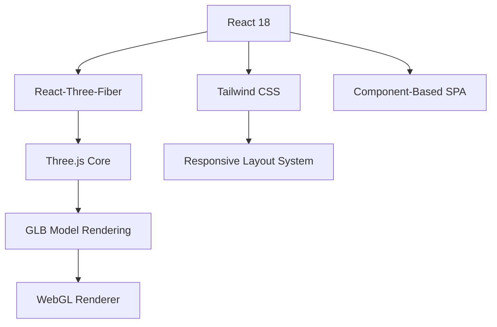

# Personal Portfolio Website
[](https://ii310.github.io/WebsitePortfolio)
[](https://react.dev/)
[](https://threejs.org/)

> *"a digital asset that represents my academic interests, personal projects and experiences"*

The goal of this project is to create a digital asset that represents my academic interests, personal projects, and creative explorations in the field of motion simulation in a 3D, interactive, dynamic, and technical form, as a solo software project from scratch through its entire lifecycle; from ideation and visual prototyping to frontend development, version control, and live deployment.


---

## Live Deployment

▶️ **Website:** https://ii310.github.io/WebsitePortfolio

---

## Project Objectives

- Integrate modern front-end technologies with a focus on modular design and visual clarity.
- Practice deployment workflows using GitHub Pages and custom build pipelines.
- Experiment with interactive modeling through tools like Three.js and React-based visualization.

---

## Technology Stack Used to Build This Website

| Layer           | Tools / Libraries                                                                 |
|----------------|-------------------------------------------------------------------------------------|
| **Frontend**    | React.js, Vite                                                                    |
| **Styling**     | Tailwind CSS, PostCSS                                                             |
| **3D Graphics** | Three.js, @react-three/fiber, @react-three/drei                                   |
| **Deployment**  | GitHub Pages (via `gh-pages` npm package)                                         |
| **Tooling**     | npm, ESLint, Git, vite.config.js                                                  |

---
# Technical Learnings and Exploration Through the Building Process
## This project was an opportunity to:

- Deepen my understanding of component-based architecture, and front-end engineering practices

- Streamlined Deployment Workflow: Using Git, npm, and GitHub Pages, created an automated deployment pipeline that enables rapid iteration and consistent version control.

- Three.js & @react-three/fiber: Integrated real-time 3D rendering into a React-based frontend, gaining experience with scene composition, lighting, and object interaction.

- Tailwind CSS: Developed a responsive and visually consistent UI using a utility-first CSS framework. 

- Vite: Optimize builds and development flow using Vite’s fast bundler and modern tooling.

- Component-Based Design in React: Improved modularization and state management practices by building reusable UI components and structuring code for maintainability.

- Project Lifecycle Management: Experienced the lifecycle of a solo software project—from ideation and visual prototyping to frontend development, version control, and live deployment.

---

# Features & Architecture

- **Single Page Application (SPA):** Built using React and dynamically rendered via `main.jsx`.
- **3D Model Rendering:** Integrates a GLB model using Three.js and @react-three/fiber for spatial interactivity.
- **Responsive Layout:** Uses utility-first CSS classes (Tailwind) to support mobile, tablet, and desktop resolutions.

### Project Structure

```plaintext
PROTFO.LIO/
├── 📁 dist/                  # Production build
│   ├── 📁 assets/            # Optimized static files
│   ├── 📁 audio/             # Sound assets
│   ├── 404.html              # Fallback route
│   └── index.html            # Entry point
│
├── 📁 public/                # Static assets
│   ├── Model.glb             # 3D model file
│   ├── star.png              # Decorative graphic
│   └── vite.svg              # Framework logo
│
├── 📁 src/                   # Source code
│   ├── 📁 assets/            # Development assets
│   │   └── react.svg         # React logo
│   │
│   ├── 📁 components/        # React components
│   │   ├── AboutMe.jsx       # Biography section
│   │   ├── ContactSection.jsx# Contact form
│   │   ├── FooterNav.jsx     # Navigation footer
│   │   ├── Header.jsx        # Page header
│   │   ├── Hero.jsx          # Landing section
│   │   ├── Model.jsx         # 3D viewer
│   │   └── ResumeModal.jsx   # CV popup
│   │
│   ├── App.jsx               # Root component
│   ├── main.jsx              # Application entry
│   └── index.css             # Global styles
│
├── .gitattributes            # Git configuration
├── .gitignore                # Version control exclusions
├── package.json              # Project manifest
└── vite.config.js            # Build configuration
```
## Technical Architecture


# Deployment Workflow
~ npm run build compiles the app to /dist

~ gh-pages package publishes the build directory to the gh-pages branch

~ GitHub Pages hosts the output using the configured homepage field in package.json

